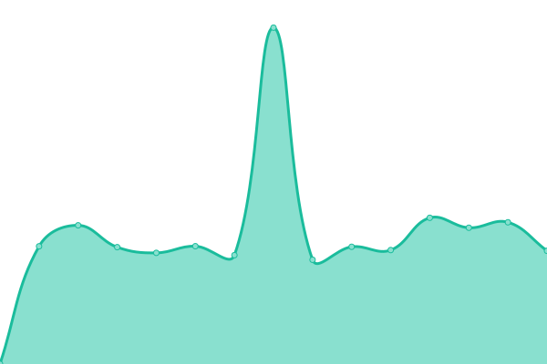

# [📈 Live Status](https://W4L33D.github.io/DrammenURLs): <!--live status--> **🟧 Partial outage**

This repository contains the open-source uptime monitor and status page for [W4L33D](https://W4L33D.github.io/DrammenURLs), powered by [Upptime](https://github.com/upptime/upptime).

With [Upptime](https://upptime.js.org), you can get your own unlimited and free uptime monitor and status page, powered entirely by a GitHub repository. We use [Issues](https://github.com/W4L33D/DrammenURLs/issues) as incident reports, [Actions](https://github.com/W4L33D/DrammenURLs/actions) as uptime monitors, and [Pages](https://W4L33D.github.io/DrammenURLs) for the status page.

<!--start: status pages-->
<!-- This summary is generated by Upptime (https://github.com/upptime/upptime) -->
<!-- Do not edit this manually, your changes will be overwritten -->
<!-- prettier-ignore -->
| URL | Status | History | Response Time | Uptime |
| --- | ------ | ------- | ------------- | ------ |
|  [Drammen Kommune](http://www.drammen.kommune.no) | 🟩 Up | [drammen-kommune.yml](https://github.com/W4L33D/DrammenURLs/commits/HEAD/history/drammen-kommune.yml) | 

 1056ms
     
 | 

<a href="https://W4L33D.github.io/DrammenURLs/history/drammen-kommune">100.00%</a>
    

|  [Eco Online](http://www.ecoonline.no) | 🟩 Up | [eco-online.yml](https://github.com/W4L33D/DrammenURLs/commits/HEAD/history/eco-online.yml) | 

 840ms
     
 | 

<a href="https://W4L33D.github.io/DrammenURLs/history/eco-online">100.00%</a>
    

|  [Qudos](http://www.qudos.no) | 🟩 Up | [qudos.yml](https://github.com/W4L33D/DrammenURLs/commits/HEAD/history/qudos.yml) | 

 1032ms
     
 | 

<a href="https://W4L33D.github.io/DrammenURLs/history/qudos">100.00%</a>
    

|  [Rosim](http://www.rosim.no) | 🟩 Up | [rosim.yml](https://github.com/W4L33D/DrammenURLs/commits/HEAD/history/rosim.yml) | 

 4651ms
     
 | 

<a href="https://W4L33D.github.io/DrammenURLs/history/rosim">100.00%</a>
    

|  [Aasiden Skolebibliotek](https://aasbib.bib.no) | 🟩 Up | [aasiden-skolebibliotek.yml](https://github.com/W4L33D/DrammenURLs/commits/HEAD/history/aasiden-skolebibliotek.yml) | 

 1830ms
     
 | 

<a href="https://W4L33D.github.io/DrammenURLs/history/aasiden-skolebibliotek">100.00%</a>
    

|  [Attic](https://attic-dk-vs3.icapire.net/) | 🟩 Up | [attic.yml](https://github.com/W4L33D/DrammenURLs/commits/HEAD/history/attic.yml) | 

 927ms
     
 | 

<a href="https://W4L33D.github.io/DrammenURLs/history/attic">100.00%</a>
    

|  [Børresen Skolebibliotek](https://borbib.bib.no) | 🟩 Up | [borresen-skolebibliotek.yml](https://github.com/W4L33D/DrammenURLs/commits/HEAD/history/borresen-skolebibliotek.yml) | 

 1851ms
     
 | 

<a href="https://W4L33D.github.io/DrammenURLs/history/borresen-skolebibliotek">100.00%</a>
    

|  [GeoDoc](https://braarkiv.no/drammen) | 🟩 Up | [geo-doc.yml](https://github.com/W4L33D/DrammenURLs/commits/HEAD/history/geo-doc.yml) | 

 3126ms
     
 | 

<a href="https://W4L33D.github.io/DrammenURLs/history/geo-doc">100.00%</a>
    

|  [Vegvesen](https://brutus.atlas.vegvesen.no/minside) | 🟥 Down | [vegvesen.yml](https://github.com/W4L33D/DrammenURLs/commits/HEAD/history/vegvesen.yml) | 

 0ms
     
 | 

<a href="https://W4L33D.github.io/DrammenURLs/history/vegvesen">3.16%</a>
    

|  [CarAdmin](https://car.caradmin.no/) | 🟩 Up | [car-admin.yml](https://github.com/W4L33D/DrammenURLs/commits/HEAD/history/car-admin.yml) | 

 746ms
     
 | 

<a href="https://W4L33D.github.io/DrammenURLs/history/car-admin">100.00%</a>
    

|  [Ardoq](https://d-ikt.ardoq.com) | 🟩 Up | [ardoq.yml](https://github.com/W4L33D/DrammenURLs/commits/HEAD/history/ardoq.yml) | 

 605ms
     
 | 

<a href="https://W4L33D.github.io/DrammenURLs/history/ardoq">100.00%</a>
    

|  [InfoCaption](https://d-ikt.infocaption.com/portal/DRMK-master) | 🟩 Up | [info-caption.yml](https://github.com/W4L33D/DrammenURLs/commits/HEAD/history/info-caption.yml) | 

 823ms
     
 | 

<a href="https://W4L33D.github.io/DrammenURLs/history/info-caption">100.00%</a>
    

|  [Trintech](https://deactx.cadency.trintech.com/) | 🟩 Up | [trintech.yml](https://github.com/W4L33D/DrammenURLs/commits/HEAD/history/trintech.yml) | 

 1682ms
     
 | 

<a href="https://W4L33D.github.io/DrammenURLs/history/trintech">100.00%</a>
    

|  [Åskollen Skolebibliotek](https://dkaassk.bib.no) | 🟩 Up | [askollen-skolebibliotek.yml](https://github.com/W4L33D/DrammenURLs/commits/HEAD/history/askollen-skolebibliotek.yml) | 

 2505ms
     
 | 

<a href="https://W4L33D.github.io/DrammenURLs/history/askollen-skolebibliotek">100.00%</a>
    

|  [Aronsløkka Skolebibliotek](https://dkaronsk.bib.no) | 🟩 Up | [aronslokka-skolebibliotek.yml](https://github.com/W4L33D/DrammenURLs/commits/HEAD/history/aronslokka-skolebibliotek.yml) | 

 1728ms
     
 | 

<a href="https://W4L33D.github.io/DrammenURLs/history/aronslokka-skolebibliotek">100.00%</a>
    

|  [Bragernes Skolebibliotek](https://dkbragsk.bib.no) | 🟩 Up | [bragernes-skolebibliotek.yml](https://github.com/W4L33D/DrammenURLs/commits/HEAD/history/bragernes-skolebibliotek.yml) | 

 1698ms
     
 | 

<a href="https://W4L33D.github.io/DrammenURLs/history/bragernes-skolebibliotek">100.00%</a>
    

|  [Brandenen Skolebibliotek](https://dkbransk.bib.no) | 🟩 Up | [brandenen-skolebibliotek.yml](https://github.com/W4L33D/DrammenURLs/commits/HEAD/history/brandenen-skolebibliotek.yml) | 

 1696ms
     
 | 

<a href="https://W4L33D.github.io/DrammenURLs/history/brandenen-skolebibliotek">100.00%</a>
    

|  [Danvik Skolebibliotek](https://dkdansk.bib.no) | 🟩 Up | [danvik-skolebibliotek.yml](https://github.com/W4L33D/DrammenURLs/commits/HEAD/history/danvik-skolebibliotek.yml) | 

 1750ms
     
 | 

<a href="https://W4L33D.github.io/DrammenURLs/history/danvik-skolebibliotek">100.00%</a>
    

|  [Fjell Skolebibliotek.](https://dkfjelsk.bib.no) | 🟩 Up | [fjell-skolebibliotek.yml](https://github.com/W4L33D/DrammenURLs/commits/HEAD/history/fjell-skolebibliotek.yml) | 

 1752ms
     
 | 

<a href="https://W4L33D.github.io/DrammenURLs/history/fjell-skolebibliotek">100.00%</a>
    

|  [Frydenhaug Skolebibliotek](https://dkfrydsk.bib.no) | 🟩 Up | [frydenhaug-skolebibliotek.yml](https://github.com/W4L33D/DrammenURLs/commits/HEAD/history/frydenhaug-skolebibliotek.yml) | 

 1719ms
     
 | 

<a href="https://W4L33D.github.io/DrammenURLs/history/frydenhaug-skolebibliotek">100.00%</a>
    

|  [Hallermoen Skolebibliotek](https://dkhallsk.bib.no) | 🟩 Up | [hallermoen-skolebibliotek.yml](https://github.com/W4L33D/DrammenURLs/commits/HEAD/history/hallermoen-skolebibliotek.yml) | 

 1697ms
     
 | 

<a href="https://W4L33D.github.io/DrammenURLs/history/hallermoen-skolebibliotek">100.00%</a>
    

|  [Kjøsterud Skole](https://dkkjosk.bib.no) | 🟩 Up | [kjosterud-skole.yml](https://github.com/W4L33D/DrammenURLs/commits/HEAD/history/kjosterud-skole.yml) | 

 1707ms
     
 | 

<a href="https://W4L33D.github.io/DrammenURLs/history/kjosterud-skole">100.00%</a>
    

|  [Øren Skolebibliotek](https://dkoresk.bib.no) | 🟩 Up | [oren-skolebibliotek.yml](https://github.com/W4L33D/DrammenURLs/commits/HEAD/history/oren-skolebibliotek.yml) | 

 1861ms
     
 | 

<a href="https://W4L33D.github.io/DrammenURLs/history/oren-skolebibliotek">100.00%</a>
    

|  [Rødskog Skolebibliotek](https://dkrodsk.bib.no) | 🟩 Up | [rodskog-skolebibliotek.yml](https://github.com/W4L33D/DrammenURLs/commits/HEAD/history/rodskog-skolebibliotek.yml) | 

 1696ms
     
 | 

<a href="https://W4L33D.github.io/DrammenURLs/history/rodskog-skolebibliotek">100.00%</a>
    

|  [Skoger Skolebibliotek](https://dkskogsk.bib.no) | 🟩 Up | [skoger-skolebibliotek.yml](https://github.com/W4L33D/DrammenURLs/commits/HEAD/history/skoger-skolebibliotek.yml) | 

 1708ms
     
 | 

<a href="https://W4L33D.github.io/DrammenURLs/history/skoger-skolebibliotek">100.00%</a>
    

|  [Marienlyst Skole](https://dkstrosk.bib.no) | 🟩 Up | [marienlyst-skole.yml](https://github.com/W4L33D/DrammenURLs/commits/HEAD/history/marienlyst-skole.yml) | 

 1695ms
     
 | 

<a href="https://W4L33D.github.io/DrammenURLs/history/marienlyst-skole">100.00%</a>
    

|  [Vestbygda Skolebibliotek](https://dkvestsk.bib.no) | 🟩 Up | [vestbygda-skolebibliotek.yml](https://github.com/W4L33D/DrammenURLs/commits/HEAD/history/vestbygda-skolebibliotek.yml) | 

 1743ms
     
 | 

<a href="https://W4L33D.github.io/DrammenURLs/history/vestbygda-skolebibliotek">100.00%</a>
    

|  [ArcGIS](https://drammen-kommune.maps.arcgis.com/) | 🟩 Up | [arc-gis.yml](https://github.com/W4L33D/DrammenURLs/commits/HEAD/history/arc-gis.yml) | 

 151ms
     
 | 

<a href="https://W4L33D.github.io/DrammenURLs/history/arc-gis">100.00%</a>
    

|  [Drammen Extend](https://drammen.extend.no/) | 🟩 Up | [drammen-extend.yml](https://github.com/W4L33D/DrammenURLs/commits/HEAD/history/drammen-extend.yml) | 

 929ms
     
 | 

<a href="https://W4L33D.github.io/DrammenURLs/history/drammen-extend">100.00%</a>
    

|  [Geminisuite](https://drammen.geminisuite.com/portal/map) | 🟩 Up | [geminisuite.yml](https://github.com/W4L33D/DrammenURLs/commits/HEAD/history/geminisuite.yml) | 

 793ms
     
 | 

<a href="https://W4L33D.github.io/DrammenURLs/history/geminisuite">100.00%</a>
    

|  [Quria](https://drammen.quria.axiell.com/) | 🟩 Up | [quria.yml](https://github.com/W4L33D/DrammenURLs/commits/HEAD/history/quria.yml) | 

 1157ms
     
 | 

<a href="https://W4L33D.github.io/DrammenURLs/history/quria">100.00%</a>
    

|  [Public 360 Online](https://drammendata-ea.public360online.com/) | 🟩 Up | [public-360-online.yml](https://github.com/W4L33D/DrammenURLs/commits/HEAD/history/public-360-online.yml) | 

 757ms
     
 | 

<a href="https://W4L33D.github.io/DrammenURLs/history/public-360-online">100.00%</a>
    

|  [EQS by extend](https://drammenhistorisk.extend.no/) | 🟩 Up | [eqs-by-extend.yml](https://github.com/W4L33D/DrammenURLs/commits/HEAD/history/eqs-by-extend.yml) | 

 1223ms
     
 | 

<a href="https://W4L33D.github.io/DrammenURLs/history/eqs-by-extend">100.00%</a>
    

|  [Drammen Kart](https://drammenkart.nois.no/webinnsyn) | 🟩 Up | [drammen-kart.yml](https://github.com/W4L33D/DrammenURLs/commits/HEAD/history/drammen-kart.yml) | 

 720ms
     
 | 

<a href="https://W4L33D.github.io/DrammenURLs/history/drammen-kart">100.00%</a>
    

|  [Fotoware](https://drammenkommune.fotoware.cloud/fotoweb) | 🟩 Up | [fotoware.yml](https://github.com/W4L33D/DrammenURLs/commits/HEAD/history/fotoware.yml) | 

 826ms
     
 | 

<a href="https://W4L33D.github.io/DrammenURLs/history/fotoware">100.00%</a>
    

|  [ServiceNow](https://drammenkommune.service-now.com/) | 🟩 Up | [service-now.yml](https://github.com/W4L33D/DrammenURLs/commits/HEAD/history/service-now.yml) | 

 649ms
     
 | 

<a href="https://W4L33D.github.io/DrammenURLs/history/service-now">100.00%</a>
    

|  [Asta](https://drammenkommune.stiftelsen-asta.no/) | 🟥 Down | [asta.yml](https://github.com/W4L33D/DrammenURLs/commits/HEAD/history/asta.yml) | 

 493ms
     
 | 

<a href="https://W4L33D.github.io/DrammenURLs/history/asta">4.17%</a>
    

|  [Test Extend](https://drammentest.extend.no/) | 🟩 Up | [test-extend.yml](https://github.com/W4L33D/DrammenURLs/commits/HEAD/history/test-extend.yml) | 

 1082ms
     
 | 

<a href="https://W4L33D.github.io/DrammenURLs/history/test-extend">100.00%</a>
    

<!--end: status pages-->

[**Visit our status website →**](https://W4L33D.github.io/DrammenURLs)

## 📄 License

- Powered by: [Upptime](https://github.com/upptime/upptime)
- Code: [MIT](./LICENSE) © [Anand Chowdhary](https://anandchowdhary.com), supported by [Pabio](https://pabio.com)
- Data in the `./history` directory: [Open Database License](https://opendatacommons.org/licenses/odbl/1-0/)
