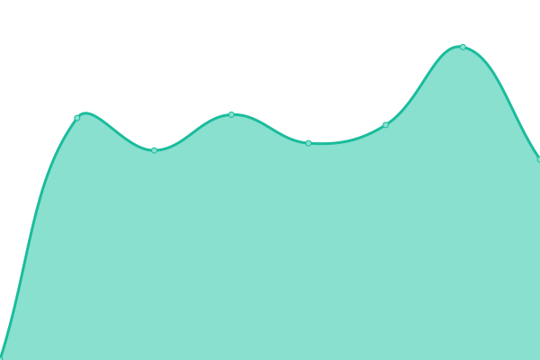
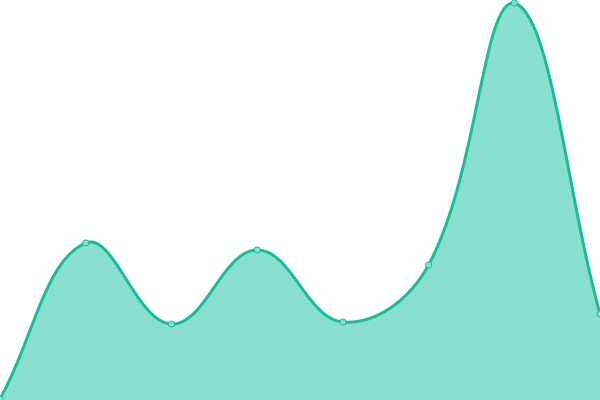
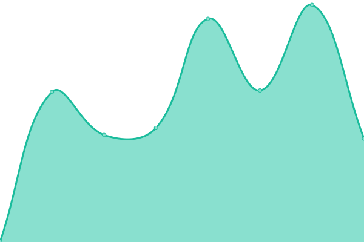
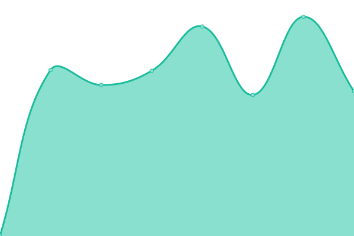
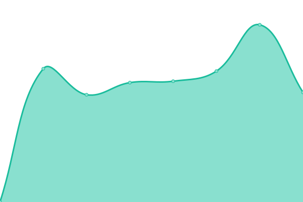
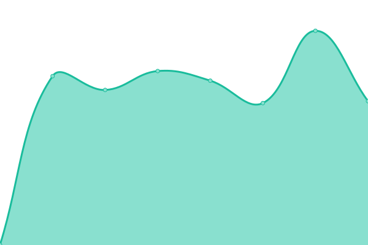
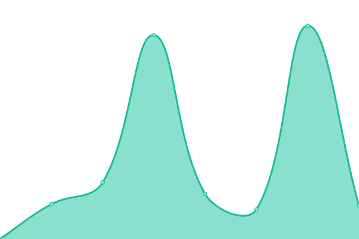
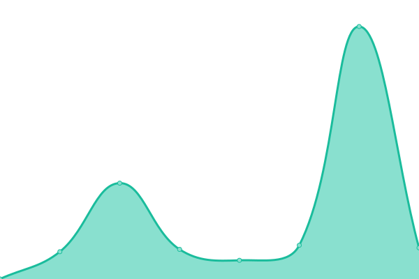

# [📈 Live Status](https://W4L33D.github.io/DrammenURLs): <!--live status--> **🟧 Partial outage**

This repository contains the open-source uptime monitor and status page for [W4L33D](https://W4L33D.github.io/DrammenURLs), powered by [Upptime](https://github.com/upptime/upptime).

With [Upptime](https://upptime.js.org), you can get your own unlimited and free uptime monitor and status page, powered entirely by a GitHub repository. We use [Issues](https://github.com/W4L33D/DrammenURLs/issues) as incident reports, [Actions](https://github.com/W4L33D/DrammenURLs/actions) as uptime monitors, and [Pages](https://W4L33D.github.io/DrammenURLs) for the status page.

<!--start: status pages-->
<!-- This summary is generated by Upptime (https://github.com/upptime/upptime) -->
<!-- Do not edit this manually, your changes will be overwritten -->
<!-- prettier-ignore -->
| URL | Status | History | Response Time | Uptime |
| --- | ------ | ------- | ------------- | ------ |
|  [Drammen Kommune](http://www.drammen.kommune.no) | 🟩 Up | [drammen-kommune.yml](https://github.com/W4L33D/DrammenURLs/commits/HEAD/history/drammen-kommune.yml) | 

 786ms
     
 | 

<a href="https://W4L33D.github.io/DrammenURLs/history/drammen-kommune">100.00%</a>
    

|  [Eco Online](http://www.ecoonline.no) | 🟩 Up | [eco-online.yml](https://github.com/W4L33D/DrammenURLs/commits/HEAD/history/eco-online.yml) | 

 890ms
     
 | 

<a href="https://W4L33D.github.io/DrammenURLs/history/eco-online">100.00%</a>
    

|  [Qudos](http://www.qudos.no) | 🟩 Up | [qudos.yml](https://github.com/W4L33D/DrammenURLs/commits/HEAD/history/qudos.yml) | 

 1346ms
     
 | 

<a href="https://W4L33D.github.io/DrammenURLs/history/qudos">100.00%</a>
    

|  [Rosim](http://www.rosim.no) | 🟩 Up | [rosim.yml](https://github.com/W4L33D/DrammenURLs/commits/HEAD/history/rosim.yml) | 

 5140ms
     
 | 

<a href="https://W4L33D.github.io/DrammenURLs/history/rosim">100.00%</a>
    

|  [Aasiden Skolebibliotek](https://aasbib.bib.no) | 🟩 Up | [aasiden-skolebibliotek.yml](https://github.com/W4L33D/DrammenURLs/commits/HEAD/history/aasiden-skolebibliotek.yml) | 

 2155ms
     
 | 

<a href="https://W4L33D.github.io/DrammenURLs/history/aasiden-skolebibliotek">100.00%</a>
    

|  [Attic](https://attic-dk-vs3.icapire.net/) | 🟩 Up | [attic.yml](https://github.com/W4L33D/DrammenURLs/commits/HEAD/history/attic.yml) | 

 937ms
     
 | 

<a href="https://W4L33D.github.io/DrammenURLs/history/attic">100.00%</a>
    

|  [Børresen Skolebibliotek](https://borbib.bib.no) | 🟩 Up | [borresen-skolebibliotek.yml](https://github.com/W4L33D/DrammenURLs/commits/HEAD/history/borresen-skolebibliotek.yml) | 

 1994ms
     
 | 

<a href="https://W4L33D.github.io/DrammenURLs/history/borresen-skolebibliotek">100.00%</a>
    

|  [GeoDoc](https://braarkiv.no/drammen) | 🟩 Up | [geo-doc.yml](https://github.com/W4L33D/DrammenURLs/commits/HEAD/history/geo-doc.yml) | 

 2850ms
     
 | 

<a href="https://W4L33D.github.io/DrammenURLs/history/geo-doc">0.00%</a>
    

|  [Vegvesen- - 404](https://brutus.atlas.vegvesen.no/minside) | 🟥 Down | [vegvesen-404.yml](https://github.com/W4L33D/DrammenURLs/commits/HEAD/history/vegvesen-404.yml) | 

 0ms
     
 | 

<a href="https://W4L33D.github.io/DrammenURLs/history/vegvesen-404">0.00%</a>
    

|  [CarAdmin](https://car.caradmin.no/) | 🟩 Up | [car-admin.yml](https://github.com/W4L33D/DrammenURLs/commits/HEAD/history/car-admin.yml) | 

 691ms
     
 | 

<a href="https://W4L33D.github.io/DrammenURLs/history/car-admin">100.00%</a>
    

|  [Ardoq](https://d-ikt.ardoq.com) | 🟩 Up | [ardoq.yml](https://github.com/W4L33D/DrammenURLs/commits/HEAD/history/ardoq.yml) | 

 612ms
     
 | 

<a href="https://W4L33D.github.io/DrammenURLs/history/ardoq">100.00%</a>
    

|  [InfoCaption](https://d-ikt.infocaption.com/portal/DRMK-master) | 🟩 Up | [info-caption.yml](https://github.com/W4L33D/DrammenURLs/commits/HEAD/history/info-caption.yml) | 

 997ms
     
 | 

<a href="https://W4L33D.github.io/DrammenURLs/history/info-caption">100.00%</a>
    

|  [Trintech](https://deactx.cadency.trintech.com/) | 🟩 Up | [trintech.yml](https://github.com/W4L33D/DrammenURLs/commits/HEAD/history/trintech.yml) | 

 1666ms
     
 | 

<a href="https://W4L33D.github.io/DrammenURLs/history/trintech">100.00%</a>
    

|  [Åskollen Skolebibliotek](https://dkaassk.bib.no) | 🟩 Up | [askollen-skolebibliotek.yml](https://github.com/W4L33D/DrammenURLs/commits/HEAD/history/askollen-skolebibliotek.yml) | 

 2032ms
     
 | 

<a href="https://W4L33D.github.io/DrammenURLs/history/askollen-skolebibliotek">100.00%</a>
    

|  [Aronsløkka Skolebibliotek](https://dkaronsk.bib.no) | 🟩 Up | [aronslokka-skolebibliotek.yml](https://github.com/W4L33D/DrammenURLs/commits/HEAD/history/aronslokka-skolebibliotek.yml) | 

 1905ms
     
 | 

<a href="https://W4L33D.github.io/DrammenURLs/history/aronslokka-skolebibliotek">100.00%</a>
    

|  [Bragernes Skolebibliotek](https://dkbragsk.bib.no) | 🟩 Up | [bragernes-skolebibliotek.yml](https://github.com/W4L33D/DrammenURLs/commits/HEAD/history/bragernes-skolebibliotek.yml) | 

 1966ms
     
 | 

<a href="https://W4L33D.github.io/DrammenURLs/history/bragernes-skolebibliotek">100.00%</a>
    

|  [Brandenen Skolebibliotek](https://dkbransk.bib.no) | 🟩 Up | [brandenen-skolebibliotek.yml](https://github.com/W4L33D/DrammenURLs/commits/HEAD/history/brandenen-skolebibliotek.yml) | 

 1879ms
     
 | 

<a href="https://W4L33D.github.io/DrammenURLs/history/brandenen-skolebibliotek">100.00%</a>
    

|  [Danvik Skolebibliotek](https://dkdansk.bib.no) | 🟩 Up | [danvik-skolebibliotek.yml](https://github.com/W4L33D/DrammenURLs/commits/HEAD/history/danvik-skolebibliotek.yml) | 

 1886ms
     
 | 

<a href="https://W4L33D.github.io/DrammenURLs/history/danvik-skolebibliotek">100.00%</a>
    

|  [Fjell Skolebibliotek.](https://dkfjelsk.bib.no) | 🟩 Up | [fjell-skolebibliotek.yml](https://github.com/W4L33D/DrammenURLs/commits/HEAD/history/fjell-skolebibliotek.yml) | 

 1905ms
     
 | 

<a href="https://W4L33D.github.io/DrammenURLs/history/fjell-skolebibliotek">100.00%</a>
    

|  [Frydenhaug Skolebibliotek](https://dkfrydsk.bib.no) | 🟩 Up | [frydenhaug-skolebibliotek.yml](https://github.com/W4L33D/DrammenURLs/commits/HEAD/history/frydenhaug-skolebibliotek.yml) | 

 1966ms
     
 | 

<a href="https://W4L33D.github.io/DrammenURLs/history/frydenhaug-skolebibliotek">100.00%</a>
    

|  [Hallermoen Skolebibliotek](https://dkhallsk.bib.no) | 🟩 Up | [hallermoen-skolebibliotek.yml](https://github.com/W4L33D/DrammenURLs/commits/HEAD/history/hallermoen-skolebibliotek.yml) | 

 1932ms
     
 | 

<a href="https://W4L33D.github.io/DrammenURLs/history/hallermoen-skolebibliotek">100.00%</a>
    

|  [Kjøsterud Skole](https://dkkjosk.bib.no) | 🟩 Up | [kjosterud-skole.yml](https://github.com/W4L33D/DrammenURLs/commits/HEAD/history/kjosterud-skole.yml) | 

 1864ms
     
 | 

<a href="https://W4L33D.github.io/DrammenURLs/history/kjosterud-skole">100.00%</a>
    

|  [Øren Skolebibliotek](https://dkoresk.bib.no) | 🟩 Up | [oren-skolebibliotek.yml](https://github.com/W4L33D/DrammenURLs/commits/HEAD/history/oren-skolebibliotek.yml) | 

 1948ms
     
 | 

<a href="https://W4L33D.github.io/DrammenURLs/history/oren-skolebibliotek">100.00%</a>
    

|  [Rødskog Skolebibliotek](https://dkrodsk.bib.no) | 🟩 Up | [rodskog-skolebibliotek.yml](https://github.com/W4L33D/DrammenURLs/commits/HEAD/history/rodskog-skolebibliotek.yml) | 

 1931ms
     
 | 

<a href="https://W4L33D.github.io/DrammenURLs/history/rodskog-skolebibliotek">100.00%</a>
    

|  [Skoger Skolebibliotek](https://dkskogsk.bib.no) | 🟩 Up | [skoger-skolebibliotek.yml](https://github.com/W4L33D/DrammenURLs/commits/HEAD/history/skoger-skolebibliotek.yml) | 

 1864ms
     
 | 

<a href="https://W4L33D.github.io/DrammenURLs/history/skoger-skolebibliotek">100.00%</a>
    

|  [Marienlyst Skole](https://dkstrosk.bib.no) | 🟩 Up | [marienlyst-skole.yml](https://github.com/W4L33D/DrammenURLs/commits/HEAD/history/marienlyst-skole.yml) | 

 1856ms
     
 | 

<a href="https://W4L33D.github.io/DrammenURLs/history/marienlyst-skole">100.00%</a>
    

|  [Vestbygda Skolebibliotek](https://dkvestsk.bib.no) | 🟩 Up | [vestbygda-skolebibliotek.yml](https://github.com/W4L33D/DrammenURLs/commits/HEAD/history/vestbygda-skolebibliotek.yml) | 

 1820ms
     
 | 

<a href="https://W4L33D.github.io/DrammenURLs/history/vestbygda-skolebibliotek">100.00%</a>
    

|  [ArcGIS](https://drammen-kommune.maps.arcgis.com/) | 🟩 Up | [arc-gis.yml](https://github.com/W4L33D/DrammenURLs/commits/HEAD/history/arc-gis.yml) | 

 145ms
     
 | 

<a href="https://W4L33D.github.io/DrammenURLs/history/arc-gis">100.00%</a>
    

|  [Drammen Extend](https://drammen.extend.no/) | 🟩 Up | [drammen-extend.yml](https://github.com/W4L33D/DrammenURLs/commits/HEAD/history/drammen-extend.yml) | 

 944ms
     
 | 

<a href="https://W4L33D.github.io/DrammenURLs/history/drammen-extend">100.00%</a>
    

|  [Geminisuite](https://drammen.geminisuite.com/portal/map) | 🟩 Up | [geminisuite.yml](https://github.com/W4L33D/DrammenURLs/commits/HEAD/history/geminisuite.yml) | 

 711ms
     
 | 

<a href="https://W4L33D.github.io/DrammenURLs/history/geminisuite">100.00%</a>
    

|  [Quria](https://drammen.quria.axiell.com/) | 🟩 Up | [quria.yml](https://github.com/W4L33D/DrammenURLs/commits/HEAD/history/quria.yml) | 

 1403ms
     
 | 

<a href="https://W4L33D.github.io/DrammenURLs/history/quria">100.00%</a>
    

|  [Public 360 Online](https://drammendata-ea.public360online.com/) | 🟩 Up | [public-360-online.yml](https://github.com/W4L33D/DrammenURLs/commits/HEAD/history/public-360-online.yml) | 

 770ms
     
 | 

<a href="https://W4L33D.github.io/DrammenURLs/history/public-360-online">0.00%</a>
    

|  [EQS by extend](https://drammenhistorisk.extend.no/) | 🟩 Up | [eqs-by-extend.yml](https://github.com/W4L33D/DrammenURLs/commits/HEAD/history/eqs-by-extend.yml) | 

 984ms
     
 | 

<a href="https://W4L33D.github.io/DrammenURLs/history/eqs-by-extend">100.00%</a>
    

|  [Drammen Kart](https://drammenkart.nois.no/webinnsyn) | 🟩 Up | [drammen-kart.yml](https://github.com/W4L33D/DrammenURLs/commits/HEAD/history/drammen-kart.yml) | 

 782ms
     
 | 

<a href="https://W4L33D.github.io/DrammenURLs/history/drammen-kart">100.00%</a>
    

|  [Fotoware](https://drammenkommune.fotoware.cloud/fotoweb) | 🟩 Up | [fotoware.yml](https://github.com/W4L33D/DrammenURLs/commits/HEAD/history/fotoware.yml) | 

 829ms
     
 | 

<a href="https://W4L33D.github.io/DrammenURLs/history/fotoware">100.00%</a>
    

|  [ServiceNow](https://drammenkommune.service-now.com/) | 🟩 Up | [service-now.yml](https://github.com/W4L33D/DrammenURLs/commits/HEAD/history/service-now.yml) | 

 1031ms
     
 | 

<a href="https://W4L33D.github.io/DrammenURLs/history/service-now">100.00%</a>
    

|  [Asta](https://drammenkommune.stiftelsen-asta.no/) | 🟥 Down | [asta.yml](https://github.com/W4L33D/DrammenURLs/commits/HEAD/history/asta.yml) | 

 483ms
     
 | 

<a href="https://W4L33D.github.io/DrammenURLs/history/asta">0.00%</a>
    

|  [Test Extend](https://drammentest.extend.no/) | 🟩 Up | [test-extend.yml](https://github.com/W4L33D/DrammenURLs/commits/HEAD/history/test-extend.yml) | 

 1001ms
     
 | 

<a href="https://W4L33D.github.io/DrammenURLs/history/test-extend">100.00%</a>
    

|  [PrintWeb](https://drmk.impleoweb.no/) | 🟩 Up | [print-web.yml](https://github.com/W4L33D/DrammenURLs/commits/HEAD/history/print-web.yml) | 

 971ms
     
 | 

<a href="https://W4L33D.github.io/DrammenURLs/history/print-web">100.00%</a>
    

|  [DriftWeb](https://dw3.dk/shared/account/signin) | 🟩 Up | [drift-web.yml](https://github.com/W4L33D/DrammenURLs/commits/HEAD/history/drift-web.yml) | 

 478ms
     
 | 

<a href="https://W4L33D.github.io/DrammenURLs/history/drift-web">0.00%</a>
    

|  [Facilit](https://fdvu.net/) | 🟩 Up | [facilit.yml](https://github.com/W4L33D/DrammenURLs/commits/HEAD/history/facilit.yml) | 

 1143ms
     
 | 

<a href="https://W4L33D.github.io/DrammenURLs/history/facilit">100.00%</a>
    

|  [Visma Flyt Sikker sak](https://flyt-sikkersak-public.visma.com/) | 🟥 Down | [visma-flyt-sikker-sak.yml](https://github.com/W4L33D/DrammenURLs/commits/HEAD/history/visma-flyt-sikker-sak.yml) | 

 0ms
     
 | 

<a href="https://W4L33D.github.io/DrammenURLs/history/visma-flyt-sikker-sak">0.00%</a>
    

|  [Framsikt - 404](https://framiskt.net) | 🟥 Down | [framsikt-404.yml](https://github.com/W4L33D/DrammenURLs/commits/HEAD/history/framsikt-404.yml) | 

 0ms
     
 | 

<a href="https://W4L33D.github.io/DrammenURLs/history/framsikt-404">0.00%</a>
    

|  [Galterud Skole](https://gltbib.bib.no) | 🟩 Up | [galterud-skole.yml](https://github.com/W4L33D/DrammenURLs/commits/HEAD/history/galterud-skole.yml) | 

 1852ms
     
 | 

<a href="https://W4L33D.github.io/DrammenURLs/history/galterud-skole">100.00%</a>
    

|  [Junglemap](https://go.nanolearning.com/) | 🟩 Up | [junglemap.yml](https://github.com/W4L33D/DrammenURLs/commits/HEAD/history/junglemap.yml) | 

 587ms
     
 | 

<a href="https://W4L33D.github.io/DrammenURLs/history/junglemap">100.00%</a>
    

|  [Grafana Opsis](https://grafana.opsis.se/) | 🟩 Up | [grafana-opsis.yml](https://github.com/W4L33D/DrammenURLs/commits/HEAD/history/grafana-opsis.yml) | 

 1221ms
     
 | 

<a href="https://W4L33D.github.io/DrammenURLs/history/grafana-opsis">100.00%</a>
    

|  [Gravekoordinering](https://gravekoordinering.no/kgrav) | 🟩 Up | [gravekoordinering.yml](https://github.com/W4L33D/DrammenURLs/commits/HEAD/history/gravekoordinering.yml) | 

 959ms
     
 | 

<a href="https://W4L33D.github.io/DrammenURLs/history/gravekoordinering">100.00%</a>
    

|  [Gulskogen Skole](https://gulbib.bib.no) | 🟩 Up | [gulskogen-skole.yml](https://github.com/W4L33D/DrammenURLs/commits/HEAD/history/gulskogen-skole.yml) | 

 1824ms
     
 | 

<a href="https://W4L33D.github.io/DrammenURLs/history/gulskogen-skole">100.00%</a>
    

|  [Norsk helsenett join nhn](https://join.nhn.no/webapp2/home) | 🟩 Up | [norsk-helsenett-join-nhn.yml](https://github.com/W4L33D/DrammenURLs/commits/HEAD/history/norsk-helsenett-join-nhn.yml) | 

 592ms
     
 | 

<a href="https://W4L33D.github.io/DrammenURLs/history/norsk-helsenett-join-nhn">100.00%</a>
    

|  [Konnerud Skole](https://knrbib.bib.no) | 🟩 Up | [konnerud-skole.yml](https://github.com/W4L33D/DrammenURLs/commits/HEAD/history/konnerud-skole.yml) | 

 1896ms
     
 | 

<a href="https://W4L33D.github.io/DrammenURLs/history/konnerud-skole">100.00%</a>
    

|  [CIM](https://kommunecim.no/bu/drammen/) | 🟩 Up | [cim.yml](https://github.com/W4L33D/DrammenURLs/commits/HEAD/history/cim.yml) | 

 768ms
     
 | 

<a href="https://W4L33D.github.io/DrammenURLs/history/cim">100.00%</a>
    

|  [Kostrahjelp](https://kostrahjelp.no/) | 🟩 Up | [kostrahjelp.yml](https://github.com/W4L33D/DrammenURLs/commits/HEAD/history/kostrahjelp.yml) | 

 878ms
     
 | 

<a href="https://W4L33D.github.io/DrammenURLs/history/kostrahjelp">100.00%</a>
    

|  [Kundeportal Certego](https://kundeportal.certego.no/login) | 🟩 Up | [kundeportal-certego.yml](https://github.com/W4L33D/DrammenURLs/commits/HEAD/history/kundeportal-certego.yml) | 

 714ms
     
 | 

<a href="https://W4L33D.github.io/DrammenURLs/history/kundeportal-certego">100.00%</a>
    

|  [LCDrammen - 404](https://lcdrammen.drammen.kommune.no/WE.EC.NO.Integration.Host/) | 🟥 Down | [lc-drammen-404.yml](https://github.com/W4L33D/DrammenURLs/commits/HEAD/history/lc-drammen-404.yml) | 

 0ms
     
 | 

<a href="https://W4L33D.github.io/DrammenURLs/history/lc-drammen-404">0.00%</a>
    

|  [Mediearkiv](https://mediearkiv.drammen.kommune.no/) | 🟩 Up | [mediearkiv.yml](https://github.com/W4L33D/DrammenURLs/commits/HEAD/history/mediearkiv.yml) | 

 1003ms
     
 | 

<a href="https://W4L33D.github.io/DrammenURLs/history/mediearkiv">100.00%</a>
    

|  [Minlegevakt](https://minlegevakt.no) | 🟩 Up | [minlegevakt.yml](https://github.com/W4L33D/DrammenURLs/commits/HEAD/history/minlegevakt.yml) | 

 986ms
     
 | 

<a href="https://W4L33D.github.io/DrammenURLs/history/minlegevakt">0.00%</a>
    

|  [Åsen skole](https://neasnsk.bib.no) | 🟩 Up | [asen-skole.yml](https://github.com/W4L33D/DrammenURLs/commits/HEAD/history/asen-skole.yml) | 

 1830ms
     
 | 

<a href="https://W4L33D.github.io/DrammenURLs/history/asen-skole">100.00%</a>
    

|  [Eknes ungdomsskole](https://neeknsk.bib.no) | 🟩 Up | [eknes-ungdomsskole.yml](https://github.com/W4L33D/DrammenURLs/commits/HEAD/history/eknes-ungdomsskole.yml) | 

 1920ms
     
 | 

<a href="https://W4L33D.github.io/DrammenURLs/history/eknes-ungdomsskole">100.00%</a>
    

|  [Killingrud ungdomsskole](https://nekilsk.bib.no) | 🟩 Up | [killingrud-ungdomsskole.yml](https://github.com/W4L33D/DrammenURLs/commits/HEAD/history/killingrud-ungdomsskole.yml) | 

 1830ms
     
 | 

<a href="https://W4L33D.github.io/DrammenURLs/history/killingrud-ungdomsskole">100.00%</a>
    

|  [Krokstad skole](https://nekrosk.bib.no) | 🟩 Up | [krokstad-skole.yml](https://github.com/W4L33D/DrammenURLs/commits/HEAD/history/krokstad-skole.yml) | 

 1832ms
     
 | 

<a href="https://W4L33D.github.io/DrammenURLs/history/krokstad-skole">100.00%</a>
    

|  [Mjøndalen skolebibliotek](https://nemjosk.bib.no) | 🟩 Up | [mjondalen-skolebibliotek.yml](https://github.com/W4L33D/DrammenURLs/commits/HEAD/history/mjondalen-skolebibliotek.yml) | 

 1859ms
     
 | 

<a href="https://W4L33D.github.io/DrammenURLs/history/mjondalen-skolebibliotek">100.00%</a>
    

|  [Solberg skolebibliotek](https://nesolsk.bib.no) | 🟩 Up | [solberg-skolebibliotek.yml](https://github.com/W4L33D/DrammenURLs/commits/HEAD/history/solberg-skolebibliotek.yml) | 

 1817ms
     
 | 

<a href="https://W4L33D.github.io/DrammenURLs/history/solberg-skolebibliotek">100.00%</a>
    

|  [Stenseth skolebiblioteket](https://nestensk.bib.no) | 🟩 Up | [stenseth-skolebiblioteket.yml](https://github.com/W4L33D/DrammenURLs/commits/HEAD/history/stenseth-skolebiblioteket.yml) | 

 1890ms
     
 | 

<a href="https://W4L33D.github.io/DrammenURLs/history/stenseth-skolebiblioteket">100.00%</a>
    

|  [Steinberg skolebibliotek](https://nestesk.bib.no) | 🟩 Up | [steinberg-skolebibliotek.yml](https://github.com/W4L33D/DrammenURLs/commits/HEAD/history/steinberg-skolebibliotek.yml) | 

 1847ms
     
 | 

<a href="https://W4L33D.github.io/DrammenURLs/history/steinberg-skolebibliotek">100.00%</a>
    

|  [Veivangen ungdomsskole bibliotek](https://neveisk.bib.no) | 🟩 Up | [veivangen-ungdomsskole-bibliotek.yml](https://github.com/W4L33D/DrammenURLs/commits/HEAD/history/veivangen-ungdomsskole-bibliotek.yml) | 

 1945ms
     
 | 

<a href="https://W4L33D.github.io/DrammenURLs/history/veivangen-ungdomsskole-bibliotek">100.00%</a>
    

|  [Drammen kulturskole ID porten](https://nodrammen.speedadmin.dk/account/signin?&ReturnUrl=%2F&) | 🟩 Up | [drammen-kulturskole-id-porten.yml](https://github.com/W4L33D/DrammenURLs/commits/HEAD/history/drammen-kulturskole-id-porten.yml) | 

 552ms
     
 | 

<a href="https://W4L33D.github.io/DrammenURLs/history/drammen-kulturskole-id-porten">100.00%</a>
    

|  [Nye Drammen EB Public 360 online](https://nyedrammen-eb.public360online.com/) | 🟩 Up | [nye-drammen-eb-public-360-online.yml](https://github.com/W4L33D/DrammenURLs/commits/HEAD/history/nye-drammen-eb-public-360-online.yml) | 

 974ms
     
 | 

<a href="https://W4L33D.github.io/DrammenURLs/history/nye-drammen-eb-public-360-online">100.00%</a>
    

|  [Nye Drammen Public 360 online](https://nyedrammen.public360online.com/) | 🟩 Up | [nye-drammen-public-360-online.yml](https://github.com/W4L33D/DrammenURLs/commits/HEAD/history/nye-drammen-public-360-online.yml) | 

 766ms
     
 | 

<a href="https://W4L33D.github.io/DrammenURLs/history/nye-drammen-public-360-online">0.00%</a>
    

|  [ACE Health](https://openfitapi.groupnos.com/#/) | 🟩 Up | [ace-health.yml](https://github.com/W4L33D/DrammenURLs/commits/HEAD/history/ace-health.yml) | 

 486ms
     
 | 

<a href="https://W4L33D.github.io/DrammenURLs/history/ace-health">100.00%</a>
    

|  [Login ID porten](https://passord.drammen.kommune.no) | 🟩 Up | [login-id-porten.yml](https://github.com/W4L33D/DrammenURLs/commits/HEAD/history/login-id-porten.yml) | 

 1311ms
     
 | 

<a href="https://W4L33D.github.io/DrammenURLs/history/login-id-porten">100.00%</a>
    

|  [Sweco](https://rosyweb.no/Login) | 🟥 Down | [sweco.yml](https://github.com/W4L33D/DrammenURLs/commits/HEAD/history/sweco.yml) | 

 0ms
     
 | 

<a href="https://W4L33D.github.io/DrammenURLs/history/sweco">0.00%</a>
    

|  [SMP Drammen Ondni](https://smpdrammen.ondni.com/) | 🟩 Up | [smp-drammen-ondni.yml](https://github.com/W4L33D/DrammenURLs/commits/HEAD/history/smp-drammen-ondni.yml) | 

 953ms
     
 | 

<a href="https://W4L33D.github.io/DrammenURLs/history/smp-drammen-ondni">0.00%</a>
    

|  [EQS by extend](https://svelvikhistorisk.extend.no/) | 🟩 Up | [eqs-by-extend.yml](https://github.com/W4L33D/DrammenURLs/commits/HEAD/history/eqs-by-extend.yml) | 

 984ms
     
 | 

<a href="https://W4L33D.github.io/DrammenURLs/history/eqs-by-extend">100.00%</a>
    

|  [Svelvik ungdomsskole](https://svkubib.bib.no) | 🟩 Up | [svelvik-ungdomsskole.yml](https://github.com/W4L33D/DrammenURLs/commits/HEAD/history/svelvik-ungdomsskole.yml) | 

 1916ms
     
 | 

<a href="https://W4L33D.github.io/DrammenURLs/history/svelvik-ungdomsskole">100.00%</a>
    

|  [Tangen skole](https://tgnbib.bib.no) | 🟩 Up | [tangen-skole.yml](https://github.com/W4L33D/DrammenURLs/commits/HEAD/history/tangen-skole.yml) | 

 1989ms
     
 | 

<a href="https://W4L33D.github.io/DrammenURLs/history/tangen-skole">100.00%</a>
    

|  [Tømmerås skole](https://tmrbib.bib.no) | 🟩 Up | [tommeras-skole.yml](https://github.com/W4L33D/DrammenURLs/commits/HEAD/history/tommeras-skole.yml) | 

 1866ms
     
 | 

<a href="https://W4L33D.github.io/DrammenURLs/history/tommeras-skole">100.00%</a>
    

|  [U4DK Erpexp-Drammenrdweb](https://u4dk.public.cloudservices.no/Erpexp-Drammenrfdweb) | 🟥 Down | [u4-dk-erpexp-drammenrdweb.yml](https://github.com/W4L33D/DrammenURLs/commits/HEAD/history/u4-dk-erpexp-drammenrdweb.yml) | 

 0ms
     
 | 

<a href="https://W4L33D.github.io/DrammenURLs/history/u4-dk-erpexp-drammenrdweb">0.00%</a>
    

|  [Varnett](https://varnett.no/portal) | 🟩 Up | [varnett.yml](https://github.com/W4L33D/DrammenURLs/commits/HEAD/history/varnett.yml) | 

 1367ms
     
 | 

<a href="https://W4L33D.github.io/DrammenURLs/history/varnett">100.00%</a>
    

|  [Varsling24](https://varsling24.net/) | 🟩 Up | [varsling24.yml](https://github.com/W4L33D/DrammenURLs/commits/HEAD/history/varsling24.yml) | 

 601ms
     
 | 

<a href="https://W4L33D.github.io/DrammenURLs/history/varsling24">100.00%</a>
    

|  [AddSecure](https://www.addsecure.no) | 🟩 Up | [add-secure.yml](https://github.com/W4L33D/DrammenURLs/commits/HEAD/history/add-secure.yml) | 

 826ms
     
 | 

<a href="https://W4L33D.github.io/DrammenURLs/history/add-secure">100.00%</a>
    

|  [Aktiv Kommune](https://www.aktiv-kommune.no/manual-publikum/) | 🟩 Up | [aktiv-kommune.yml](https://github.com/W4L33D/DrammenURLs/commits/HEAD/history/aktiv-kommune.yml) | 

 743ms
     
 | 

<a href="https://W4L33D.github.io/DrammenURLs/history/aktiv-kommune">100.00%</a>
    

|  [Kursportal](https://www.drmk-kursportal.no/) | 🟩 Up | [kursportal.yml](https://github.com/W4L33D/DrammenURLs/commits/HEAD/history/kursportal.yml) | 

 607ms
     
 | 

<a href="https://W4L33D.github.io/DrammenURLs/history/kursportal">100.00%</a>
    

|  [eDialog](https://www.edialog24.no/client) | 🟩 Up | [e-dialog.yml](https://github.com/W4L33D/DrammenURLs/commits/HEAD/history/e-dialog.yml) | 

 1382ms
     
 | 

<a href="https://W4L33D.github.io/DrammenURLs/history/e-dialog">100.00%</a>
    

|  [Flyt Samspill](https://www.individplan.no/samspill) | 🟩 Up | [flyt-samspill.yml](https://github.com/W4L33D/DrammenURLs/commits/HEAD/history/flyt-samspill.yml) | 

 758ms
     
 | 

<a href="https://W4L33D.github.io/DrammenURLs/history/flyt-samspill">100.00%</a>
    

|  [Sticos](https://www.sticos.no/logg-inn) | 🟩 Up | [sticos.yml](https://github.com/W4L33D/DrammenURLs/commits/HEAD/history/sticos.yml) | 

 732ms
     
 | 

<a href="https://W4L33D.github.io/DrammenURLs/history/sticos">100.00%</a>
    

|  [Viascan](https://www.viascan.no/) | 🟩 Up | [viascan.yml](https://github.com/W4L33D/DrammenURLs/commits/HEAD/history/viascan.yml) | 

 563ms
     
 | 

<a href="https://W4L33D.github.io/DrammenURLs/history/viascan">100.00%</a>
    

|  [Viatraffic - 401](https://www.viatraffic.com/viaservicecenter/) | 🟥 Down | [viatraffic-401.yml](https://github.com/W4L33D/DrammenURLs/commits/HEAD/history/viatraffic-401.yml) | 

 371ms
     
 | 

<a href="https://W4L33D.github.io/DrammenURLs/history/viatraffic-401">0.00%</a>
    

<!--end: status pages-->

[**Visit our status website →**](https://W4L33D.github.io/DrammenURLs)

## 📄 License

- Powered by: [Upptime](https://github.com/upptime/upptime)
- Code: [MIT](./LICENSE) © [Anand Chowdhary](https://anandchowdhary.com), supported by [Pabio](https://pabio.com)
- Data in the `./history` directory: [Open Database License](https://opendatacommons.org/licenses/odbl/1-0/)
